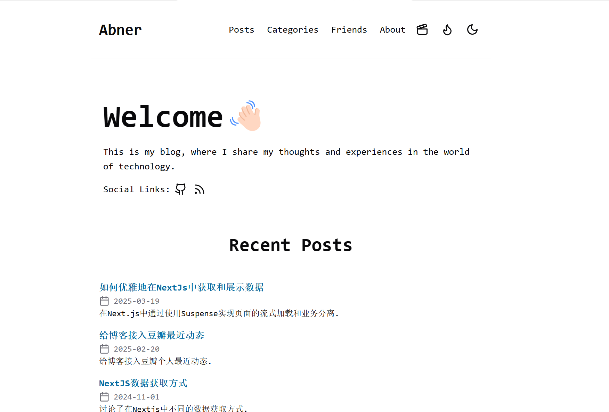
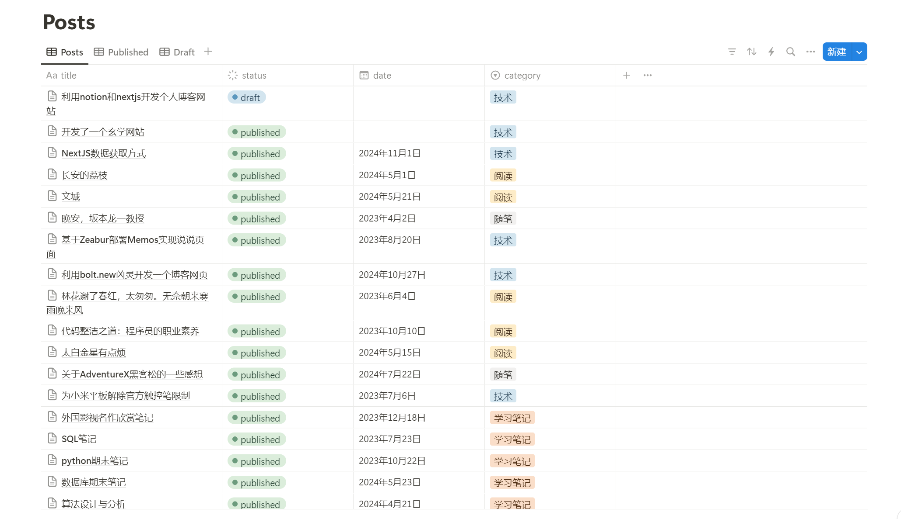

# 基于NextJS和Notion的Blog网站

## 展示

体验地址 [Abner's Blog](https://blog.luckyabner.top/)

## 技术栈

- NextJS
- Notion API
- TailwindCSS

### 前端

### 数据库端

## 使用方式

1. fork仓库
2. 根据.env.example创建.env文件并配置
3. 在 /src/config.js 中配置页面信息
4. 可以一键部署到vercel，也可以自行部署

##  相关链接
- 网站图标 - [LogoCook](https://www.logocook.shop/)

## 有任何不懂或想寻求帮助欢迎主页联系我

## LICENSE

This project is licensed under the [MIT License](LICENSE).
