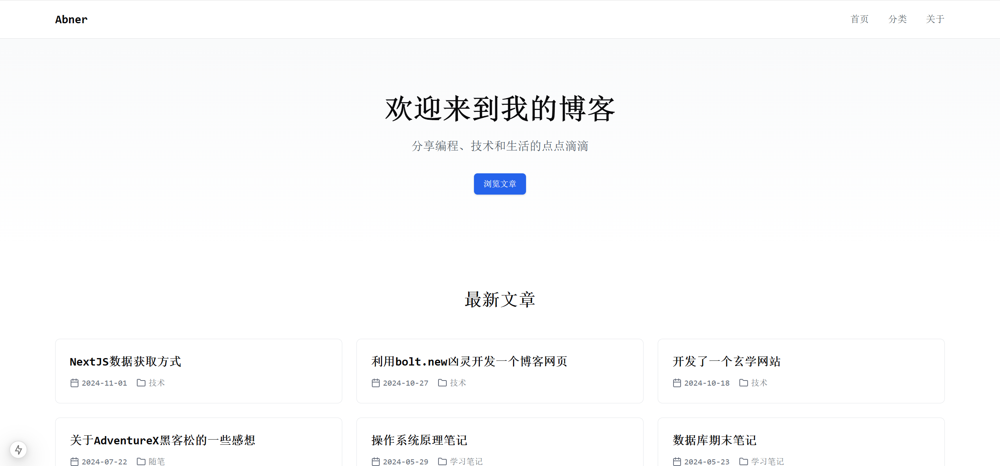

# 基于NextJS和Notion的Blog网站
## 展示
体验地址 [Abner's Blog](https://blog.luckyabner.top/)
### 前端

### 数据库端

## 使用方式
1. fork仓库
2. 在项目根目录新建.env文件，加入NOTION_ACCESS_TOKEN，NOTION_DATABASE_POST_ID，NOTION_ABOUTPAGE_ID
